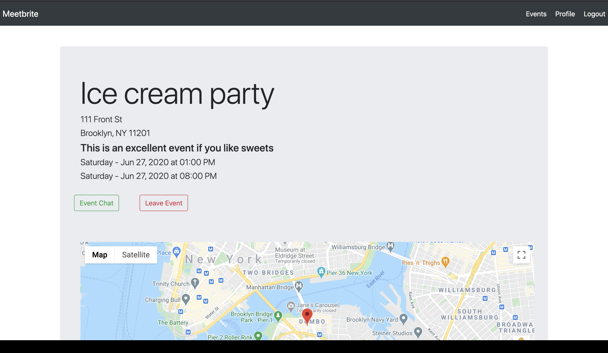

# Meetbrite

> Event management application with attendee messaging 

Meetbrite is an event management application with important features that are overlooked by other similar apps in the market.  Meetbrite allows the users to search and find nearby events, sign up for events, or create their own events that can either be public or private.  A user has the ability to communicate in real-time with other attendees through the event's group messaging page.  Users have the ability to also send private direct messages to individual users through the direct-messaging feature.   

## Demo

## Tech Stack 
**Backend**
1. Ruby on Rails 
2. ActiveRecord 
3. Bcrypt for user authentication 
4. Sessions/cookies for user persistence  
5. ActionCable/ WebSockets 

**Front-end**
1. Ruby views
2. HTML
3. CSS
4. Bootstrap 
5. JS (for map display and messaging functionality only)

## To run on your local machine:
#### Prerequisites:
- Ruby on Rails
- SQLite3 
- Redis

#### Instructions:  

Clone this repository onto your machine using `git clone`.  
`cd` into the repository  
Run `bundle install` to download the necessary gems.  
Run `rails db:migrate` to create the database and the migrations.  
Run `rails db:seed` to seed the database.  
Run `rails s` to start the rails server (it will run on on PORT 3000). 

Open [localhost:3000](http://localhost:3000) in your browser.